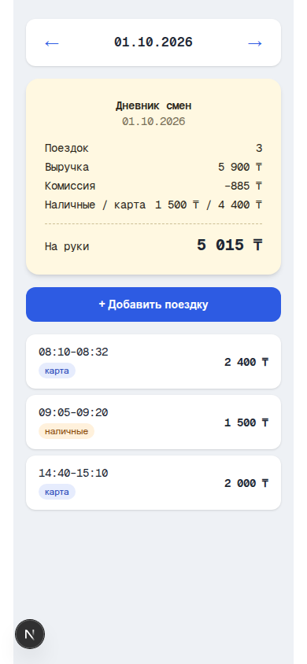

# Дневник смен водителя

Тестовое задание для вакансии в arqa: небольшое full-stack приложение, которое
показывает водителю список поездок за выбранный день и сводку (выручка,
комиссия, «на руки», разбивка наличные/карта), позволяет листать дни и
добавлять поездки через API с защитой от дублей.



## Быстрый старт

Требуется Node.js 20+.

```bash
npm install
npm run dev
```

Откройте [http://localhost:3000](http://localhost:3000). База данных (SQLite)
создаётся и засеивается автоматически при первом обращении — никаких
дополнительных команд не нужно. По умолчанию приложение открывается на
`2026-10-01` — это тот самый день из примера в задании, числа сходятся
один в один с чеком на странице вакансии.

```bash
npm test        # юнит- и интеграционные тесты (vitest)
npm run lint    # eslint
npm run build   # production-сборка Next.js
```

## Что сделано (по пунктам задания)

1. **Сервер отдаёт по API список поездок за день и сводку** —
   `GET /api/days/:date` → `{ date, trips, summary }`, где `summary` включает
   `count`, `revenue`, `commission`, `net` («на руки») и `byPayment.{cash,card}`.
2. **Клиент показывает сводку и список поездок, позволяет переключать дни** —
   стрелки `←/→` в `src/components/ShiftDiary.tsx`.
3. **Добавление поездки через API с валидацией и защитой от дублей** —
   `POST /api/trips`, проверка `amount > 0` и `end > start` (zod), повторная
   отправка не создаёт дубль (подробнее — ниже).
4. **Тесты на расчёт сводки и защиту от дублей** — `tests/domain.test.ts` и
   `tests/api.test.ts`, 17 тестов, все проходят (`npm test`).

## API

### `GET /api/days/:date`

`:date` — `YYYY-MM-DD`. Невалидная дата → `400`.

```bash
curl http://localhost:3000/api/days/2026-10-01
```

```json
{
  "date": "2026-10-01",
  "trips": [
    { "id": "t1", "start": "2026-10-01T08:10:00+05:00", "end": "2026-10-01T08:32:00+05:00", "amount": 2400, "payment": "card", "commission": 360 }
  ],
  "summary": {
    "count": 3,
    "revenue": 5900,
    "commission": 885,
    "net": 5015,
    "byPayment": { "cash": 1500, "card": 4400 }
  }
}
```

### `POST /api/trips`

```bash
curl -X POST http://localhost:3000/api/trips \
  -H 'content-type: application/json' \
  -d '{"start":"2026-10-03T08:00:00+05:00","end":"2026-10-03T08:15:00+05:00","amount":1000,"payment":"card","commission":150}'
```

- `id` — необязателен.
- Валидация (zod): `amount > 0`, `commission >= 0`, `end > start`, `payment`
  ∈ `{cash, card}`. Ошибка → `400` с перечнем проблемных полей.
- Успех → `201` и `{ trip, duplicate: false }`.
- Повтор того же `id` (или тех же `start/end/amount/payment/commission` без
  `id`) → `200` и `{ trip, duplicate: true }`, новой записи не создаётся.

**Как устроена защита от дублей.** Если клиент передал `id` — он и есть
ключ идемпотентности: запись с таким `id` ищется до вставки. Если `id` не
передан, сервер считает детерминированный fingerprint (SHA-256 от
`start+end+amount+payment+commission`) и использует его как `id`. Это даёт
ту же гарантию, что и заголовок `Idempotency-Key` у Stripe/аналогов, но без
обязательного участия клиента — byte-identical повтор запроса (из-за
обрыва связи и ретрая, например) распознаётся как дубль сам по себе.
Уникальность обеспечена `PRIMARY KEY` на `trips.id` в SQLite.

## Архитектура

```
src/
  lib/
    date.ts       # день = подстрока ISO-строки до 'T' (см. ниже, почему не new Date())
    shift.ts       # типы Trip/DaySummary, чистая функция summarize(), zod-схема
    db.ts          # better-sqlite3: схема, сидирование, идемпотентная вставка
  data/
    trips-seed.json  # стартовые данные: t1/t2 из задания + ещё 6 поездок на соседние дни
  app/
    api/days/[date]/route.ts   # GET
    api/trips/route.ts         # POST
    page.tsx                    # рендерит <ShiftDiary />
  components/
    ShiftDiary.tsx  # вся клиентская часть: переключатель дней, чек-карточка,
                     # список поездок, форма добавления (useSWR для данных)
tests/
  domain.test.ts    # summarize(), dayKeyOf(), isValidDayKey(), shiftDayKey()
  api.test.ts        # интеграционные тесты поверх GET/POST route-хендлеров
```

**Хранилище.** SQLite через `better-sqlite3` — файл, без внешней
инфраструктуры. На Vercel пишется в `/tmp` (там файловая система
read-write), локально — в `data/shifts.db` (в `.gitignore`). Это
сознательный компромисс ради «запускается одной командой»: при локальном
запуске данные персистентны, на serverless-деплое demo-данные могут
сброситься между холодными стартами — для тестового задания это приемлемо
и явно описано здесь, а не тихо.

**Часовой пояс.** Поездки приходят как ISO 8601 с явным offset
(`+05:00`). «День» поездки — это просто подстрока до `T` в этой строке:
offset уже кодирует локальное время водителя, так что конвертация через
`new Date(...).toISOString()` не нужна и только создала бы риск сдвинуть
поездку на соседние сутки для не-UTC офсетов. Это специально
протестировано в `tests/domain.test.ts`.

## Тесты

```bash
npm test
```

17 тестов: расчёт сводки (включая сверку с примером из задания — 3900 ₸
выручки, 585 ₸ комиссии, 3315 ₸ на руки), граничные случаи (`0` поездок,
только наличные/только карта), валидация дат, и для API — отклонение
некорректных данных, создание поездки, дедупликация по `id`, дедупликация
по содержимому без `id`, и что две *разные* поездки в один день дублями не
считаются.

CI (`.github/workflows/ci.yml`) гоняет `lint` → `test` → `build` на каждый
push/PR — по аналогии с «ревью и автопроверки на каждое изменение» из
описания вакансии.

## Как использовался ИИ

Проект собран с Claude Code (Claude). Ниже — конкретные моменты, где
ассистент ошибся или где решение потребовало проверки, а не слепого
доверия модели:

- **Next.js 16 новее знаний модели.** В репозитории есть `AGENTS.md`,
  явно предупреждающий, что эта версия Next.js может ломать привычные
  API. Перед написанием route-хендлеров ассистент сверился с
  `node_modules/next/dist/docs/` и подтвердил, что `params` в App Router
  теперь `Promise`, а не плоский объект — иначе код бы падал в рантайме.
- **Cache Components включены по умолчанию** в шаблоне `create-next-app`
  (`cacheComponents: true`). Для простого CRUD-приложения это добавляет
  обязательные `Suspense`-границы и директивы `use cache` без реальной
  выгоды — осознанно отключено в `next.config.ts` в пользу классической
  модели рендеринга.
- **Конфликт версий при установке vitest**: `npm install -D vitest`
  упал с ошибкой peer-dependency (`vitest@5` требует `@types/node >=24`,
  а шаблон Next.js ставит `^20`). Исправлено обновлением `@types/node`.
- **Реальный баг, пойманный линтером, не человеком.** Первая версия
  `ShiftDiary.tsx` загружала данные через `useEffect` + ручные
  `setLoading/setData/setError` — классический, но, как оказалось,
  не одобряемый новым правилом `react-hooks/set-state-in-effect`
  паттерн. Вместо того чтобы заглушить предупреждение, компонент
  переписан на `useSWR` — короче, и предупреждение ушло, потому что
  причина (каскадные синхронные `setState` в эффекте), а не симптом,
  была устранена.
- **Путь к файлу БД не учитывал serverless.** Первая версия `db.ts`
  писала SQLite-файл в `process.cwd()/data`, что отвалится на Vercel —
  файловая система там read-only везде, кроме `/tmp`. Добавлена
  проверка `process.env.VERCEL` с явным комментарием о компромиссе.
- Там, где ИИ был не нужен много: бизнес-логика (`summarize`,
  идемпотентность) — это ~40 строк чистых функций, которые быстрее и
  надёжнее было написать и проверить тестами напрямую, чем
  вычитывать сгенерированный вариант на предмет тонких ошибок в округлении
  или порядке операций.

## Деплой

Проект готов к деплою на Vercel (`vercel deploy`) без дополнительной
настройки — переменные окружения не требуются. Учтите оговорку про `/tmp`
выше: для постоянного хранилища в проде стоит заменить `better-sqlite3`
на управляемую БД (например, Postgres через Vercel Marketplace), слой
`src/lib/db.ts` для этого спроектирован как единственная точка доступа к
данным — остальной код от конкретной СУБД не зависит.
